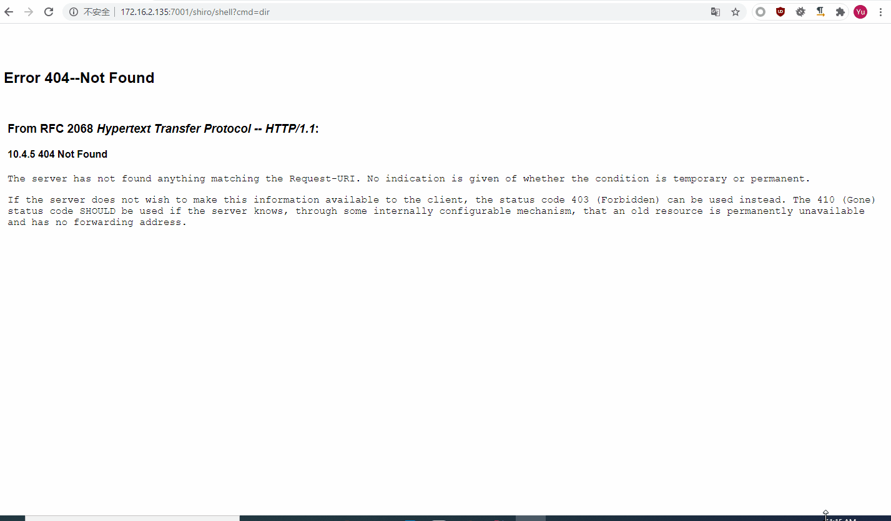

# WebLogic CVE-2020-2883 Shiro rememberMe反序列化注册filter内存shell
org/chabug/cve/CVE_2020_2883_URLClassLoader.java:27处的jar是`jar cvf a.jar WebLogicEcho.class`编译的，可以通过命令执行写入jar包到目标机器。

WebLogicEcho.java:43中的codeClass是MyFilter.class的字节码数组，自己改MyFilter类实现自己的shell

不要给MyFilter和WebLogicEcho类加包名，不然org/chabug/cve/CVE_2020_2883_URLClassLoader.java:31中等等地方也得改，麻烦。

shell的注册地址在org/chabug/payloads/WebLogicEcho.java:51修改

# 已知问题
1. 使用PythonInterpreter定义字节码会直接把weblogic进程打挂.
2. Filter shell无法获取pageContext，导致无法使用哥斯拉、蚁剑、冰蝎等工具链接，暂时只实现了cmdshell。

其他自己踩坑。

# 参考
1. https://www.cnblogs.com/potatsoSec/p/13162792.html

感谢宽字节团队@蛋黄