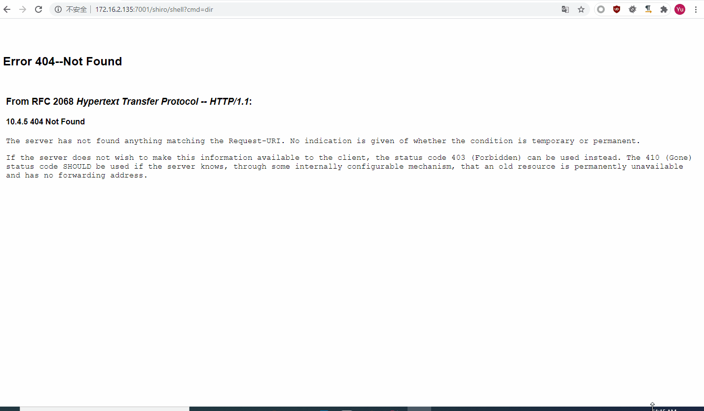
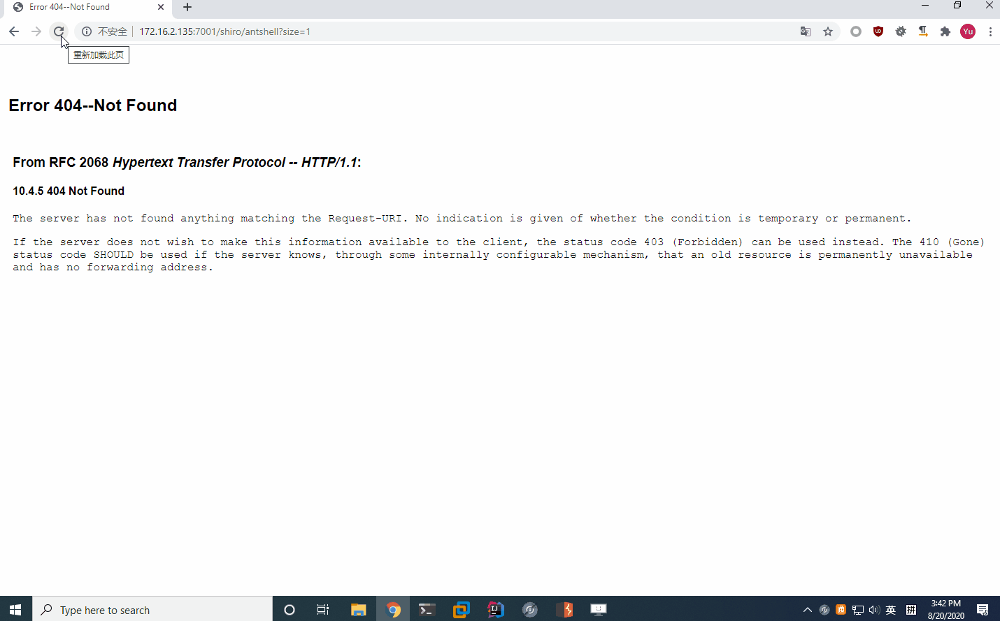

# WebLogic CVE-2020-2883 Shiro rememberMe反序列化注册filter内存shell
test on WebLogic 12.1.3.0.0

MyFilter为cmdshell

MyAntShellFilter为蚁剑shell 蚁剑链接 http://localhost/shiro/aaa?size=1 密码为ant

# 使用方法
1. 更换coherence.jar为目标WebLogic同一版本的jar包
2. 编译MyAntShellFilter或者MyFilter，然后通过CVE_2020_2555.java写入目标磁盘
3. 修改org/chabug/payloads/WebLogicEcho.java:34为上一步写入的class路径
4. 修改org/chabug/payloads/WebLogicEcho.java:41为你的filter shell地址
5. 编译WebLogicEcho.java 使用命令`jar cvf tttt.jar WebLogicEcho.class`打jar包，然后通过CVE_2020_2555.java写入目标磁盘
6. 修改org/chabug/cve/CVE_2020_2883_URLClassLoader.java:27为上一步的jar包路径
7. 运行CVE_2020_2883_URLClassLoader.java生成rememberMe cookie
8. go

# 已知问题
1. 使用PythonInterpreter定义字节码会直接把WebLogic进程打挂.
2. 解决了filter中拿不到pageContext的问题，修改蚁剑的jsp马为filter马，见MyAntShellFilter.java
3. 因为MyAntShellFilter.class字节码太长，所以直接通过getBytesByFile()读取本地文件拿字节码数组。

# TODO
1. 不使用URLClassLoader怎么加载字节码**大**数组

# 参考
1. https://www.cnblogs.com/potatsoSec/p/13162792.html

# end
别问我为什么写这个东西，碰到了而已。另外特别感谢宽字节团队@蛋黄